# Counting Game - Product Requirements Document

**Version:** 1.0.0
**Date:** October 13, 2025
**Status:** Draft - Ready for Review
**Framework Version:** 1.2.0

---

## Executive Summary

### Vision

Create the **simplest possible correspondence game** that demonstrates all framework capabilities while being instantly understandable to any player.

### Game Concept

Two players compete to see who can count higher. Players alternate entering the next number in sequence. The game validates input in real-time - the confirm button only enables when the correct number is entered. Players can give up at any time. The last player still counting wins.

### Why This Game?

- ✅ **Minimal complexity** - Perfect for framework demonstration
- ✅ **Zero learning curve** - Everyone knows how to count
- ✅ **Tests all framework features** - URL encoding, state management, dual modes, player ID system, input validation
- ✅ **Quick games** - 30-60 seconds per game
- ✅ **Clear win/lose conditions** - First to give up loses
- ✅ **Demonstrates framework patterns** - Can be used as reference implementation

### Success Criteria

1. Game playable in < 5 minutes from start to finish
2. Both hot-seat and URL modes work flawlessly
3. Input validation prevents invalid moves (confirm button disabled until correct)
4. Give up functionality works correctly
5. All 164+ framework tests pass
6. Complete documentation following framework standards
7. Can be used as a reference for future games

---

## Framework Documentation References

This PRD follows the Correspondence Games Framework standards. Key documentation:

- **`/packages/core/STATE_DIAGRAM_TEMPLATE.md`** - Unified state machine pattern (hot-seat + URL modes)
- **`/packages/core/NAME_COLLECTION_PATTERN.md`** - Styled HTML forms with dark mode support
- **`/packages/core/DARK_MODE_GUIDE.md`** - MANDATORY dark mode implementation guide
- **`/packages/core/NEW_GAME_GUIDE.md`** - Complete game creation blueprint
- **`/packages/core/FRAMEWORK_UPDATES.md`** - Update log for new patterns

**Implementation Note:** All implementers (AI agents or human developers) should read these documents before starting. The patterns are battle-tested and ensure consistency across all games in the framework.

---

## Problem & Solution

### Problem

**New developers need a simple reference game** to understand the Correspondence Games Framework patterns without the complexity of tic-tac-toe logic.

**Current Situation:**
- Tic-tac-toe has complex win detection (8 possible patterns)
- Emoji-chain has variable-length state
- No "hello world" equivalent game

### Solution

**Counting game provides:**
- Single line of state (current count + player turn)
- Real-time input validation (next number = current + 1)
- Clear endurance challenge (who can count higher?)
- Minimal UI (number display, input field, and give up button)
- Complete framework feature coverage

**Target Users:**
1. Framework developers learning patterns
2. Contributors adding new games
3. AI agents implementing games from PRDs

---

## Game Rules

### Objective

**"I can count higher than you!"**

Count as high as possible. The player who gives up first loses.

### How to Play

1. **Player 1** enters "1"
2. **Player 2** enters "2"
3. **Player 1** enters "3"
4. Continue alternating...
5. At any time, click **"Give Up"** to forfeit

### Input Validation

The game validates your input in real-time:
- ✅ **Correct number** → Confirm button enables
- ❌ **Wrong number** → Confirm button stays disabled
- ❌ **Non-number** → Confirm button stays disabled

You cannot progress until you enter the correct next number.

### Win Conditions

**You win if your opponent gives up first.**

**You lose if you give up.**

**Draw Conditions:**
- None (someone must eventually give up)

### Validation Rules

The input field accepts any text, but the confirm button only enables when:
- Input is a valid positive integer
- Input equals current count + 1
- No leading zeros (e.g., "05" is invalid)
- No decimals (only whole numbers)
- Whitespace is trimmed before validation

**Examples:**
- Current count is 42
- Valid input: "43" ✅ (confirm button enabled)
- Invalid inputs: "44" ❌, "42" ❌, "abc" ❌, "43.0" ❌, "043" ❌ (confirm button disabled)

---

## User Stories

### Epic: Core Gameplay

#### Story 1: Start a New Game

**As a** player
**I want** to choose between hot-seat and URL mode
**So that** I can play locally or remotely

**Acceptance Criteria:**
- [ ] Player 1 enters their name (using framework name collection pattern)
- [ ] Player sees mode selection screen
- [ ] Clicking hot-seat starts local game
- [ ] Clicking URL starts remote game
- [ ] Name is pre-filled from localStorage if available
- [ ] Can edit pre-filled name

**Implementation Note:** Follow `/packages/core/NAME_COLLECTION_PATTERN.md` for styled HTML forms with dark mode support. Do NOT use JavaScript `prompt()` dialogs.

**Flow Diagram:**


#### Story 2: Make a Move (Hot-Seat)

**As a** player in hot-seat mode
**I want** to enter the next number and pass the device
**So that** my opponent can take their turn

**Acceptance Criteria:**
- [ ] See current count displayed
- [ ] Enter next number in input field
- [ ] Confirm button disabled until correct number entered
- [ ] Confirm button enables when correct number entered
- [ ] Click "Confirm & Hand Off" (only enabled when input valid)
- [ ] See handoff screen with count just entered
- [ ] Other player clicks "I'm Ready"
- [ ] Other player sees their turn

**Flow Diagram:**


#### Story 3: Make a Move (URL Mode)

**As a** player in URL mode
**I want** to enter the next number and share a URL
**So that** my remote opponent can take their turn

**Acceptance Criteria:**
- [ ] See current count displayed
- [ ] Enter next number in input field
- [ ] Confirm button disabled until correct number entered
- [ ] Confirm button enables when correct number entered
- [ ] Click "Confirm & Generate URL" (only enabled when input valid)
- [ ] URL is generated with updated state
- [ ] Can copy URL to clipboard
- [ ] Other player opens URL and sees their turn

**Flow Diagram:**



```mermaid
sequenceDiagram
    participant P1 as Player 1 (Browser A)
    participant App as Game
    participant P2 as Player 2 (Browser B)

    P1->>App: View count (e.g., 4)
    P1->>App: Type "5"
    App->>App: Validate (5 === 4 + 1) ✓
    App->>P1: Enable confirm button
    P1->>App: Click "Confirm & Generate URL"
    App->>App: Update state (count=5, player=2)
    App->>App: Generate URL with state + checksum
    App->>P1: Show URL with copy button
    P1->>P1: Copy URL
    P1->>P2: Share URL (text, email, etc.)
    P2->>App: Open URL
    App->>App: Decode state from URL
    App->>App: Validate checksum ✓
    App->>P2: Show count (5), input for 6 (button disabled)
```

#### Story 4: Give Up

**As a** player
**I want** to give up at any time during my turn
**So that** I can end the game if I don't want to continue

**Acceptance Criteria:**
- [ ] "Give Up" button visible during my turn
- [ ] Clicking "Give Up" shows confirmation dialog
- [ ] Confirming gives up and ends the game
- [ ] Game status changes to opponent wins
- [ ] Winner sees "🎉 You Win! [Opponent] gave up at count [X]"
- [ ] Loser sees "❌ You Lose! You gave up at count [X]"
- [ ] Final count is displayed
- [ ] Can play again or return to main menu

**Give Up Flow:**

```typescript
function handleGiveUp(gameState: CountingGameState, playerWhoGaveUp: 1 | 2): CountingGameState {
  const winner = playerWhoGaveUp === 1 ? 2 : 1;

  return {
    ...gameState,
    status: winner === 1 ? 'player1_wins' : 'player2_wins',
    // Keep current count to show "gave up at X"
  };
}
```

**UI Notes:**
- Give up button should be secondary style (not prominent)
- Placed below the input/confirm area
- Confirmation dialog: "Are you sure you want to give up?"

### Epic: Player Experience

#### Story 5: Player 2 Joins Game

**As a** player 2
**I want** to enter my name when I first join
**So that** the game knows who I am

**Acceptance Criteria:**
- [ ] On first handoff (after P1's first move), P2 name prompt appears
- [ ] P2 enters their name
- [ ] Name is saved to localStorage
- [ ] Game continues to P2's turn
- [ ] In URL mode, warning is shown about browser memory
- [ ] In hot-seat mode, no warning shown

#### Story 6: Resume Game

**As a** returning player
**I want** my game to persist across page refreshes
**So that** I don't lose progress

**Acceptance Criteria:**
- [ ] Game state saved to localStorage after each move
- [ ] Refreshing page loads current game state
- [ ] Player names are preserved
- [ ] Current count is preserved
- [ ] Turn order is preserved

#### Story 7: Handle localStorage Cleared

**As a** player whose browser cleared localStorage
**I want** to see a clear error message
**So that** I know the game cannot continue

**Acceptance Criteria:**
- [ ] If player's name exists in game state but not in localStorage, show error
- [ ] Error message: "⚠️ Browser data cleared. Cannot resume game."
- [ ] Option to start new game
- [ ] Option to return to main menu

---

## Technical Architecture

### System Components


### Data Flow


### State Machine (Unified Flow)

**Implementation Note:** This follows the unified flow pattern from `/packages/core/STATE_DIAGRAM_TEMPLATE.md`. Hot-seat and URL modes share the same state flow with only UI differences (handoff screen vs URL generation).


**Note:** The state `MoveSelected` represents when the user has typed a valid number and the confirm button is enabled. The game uses real-time input validation - the confirm button only enables when the entered number is correct.

---

## Data Models

### Game State Schema

```typescript
import { z } from 'zod';

export const PlayerSchema = z.object({
  id: z.string().uuid(),
  name: z.string().min(1),
});

export const GameStatusSchema = z.enum([
  'playing',
  'player1_wins',
  'player2_wins',
]);

export const CountingGameStateSchema = z.object({
  gameId: z.string().uuid(),

  // Current count (starts at 0, first player enters 1)
  currentCount: z.number().int().min(0),

  // Current turn number (increments each move)
  currentTurn: z.number().int().min(0),

  // Whose turn (1 or 2)
  currentPlayer: z.union([z.literal(1), z.literal(2)]),

  // Player info
  player1: PlayerSchema,
  player2: PlayerSchema,

  // Game status
  status: GameStatusSchema,

  // Security
  checksum: z.string().length(64), // SHA-256
});

export type CountingGameState = z.infer<typeof CountingGameStateSchema>;
export type Player = z.infer<typeof PlayerSchema>;
export type GameStatus = z.infer<typeof GameStatusSchema>;
```

### localStorage Keys

**Both Modes:**
- `correspondence-games:my-name` - Current player's name
- `correspondence-games:my-player-id` - Persistent UUID
- `counting-game:game-state` - Serialized game state

**Hot-Seat Mode Only:**
- `correspondence-games:player1-name` - Player 1's specific name
- `correspondence-games:player2-name` - Player 2's specific name

### React State

```typescript
// App.tsx state
const [gameMode, setGameMode] = useState<'hotseat' | 'url' | null>(null);
const [player1Name, setPlayer1Name] = useState<string | null>(null);
const [player2Name, setPlayer2Name] = useState<string | null>(null);
const [gameState, setGameState] = useState<CountingGameState | null>(null);
const [shareUrl, setShareUrl] = useState<string>('');
const [myPlayerNumber, setMyPlayerNumber] = useState<1 | 2 | null>(null);
const [myPlayerId, setMyPlayerId] = useState<string>('');
const [selectedNumber, setSelectedNumber] = useState<string>(''); // Input field value
const [inputError, setInputError] = useState<string | null>(null);
```

---

## API Specifications

### Core Functions

#### createInitialGameState

```typescript
function createInitialGameState(
  gameId: string,
  player1Id: string,
  player1Name: string
): Omit<CountingGameState, 'checksum'> {
  return {
    gameId,
    currentCount: 0,
    currentTurn: 0,
    currentPlayer: 1,
    player1: { id: player1Id, name: player1Name },
    player2: { id: '', name: '' },
    status: 'playing',
  };
}
```

#### makeMove

```typescript
function makeMove(
  gameState: CountingGameState,
  enteredNumber: number
): Omit<CountingGameState, 'checksum'> {
  // NOTE: Input is already validated by UI - confirm button only enables for valid input
  // This function just updates the state

  return {
    ...gameState,
    currentCount: enteredNumber,
    currentTurn: gameState.currentTurn + 1,
    currentPlayer: gameState.currentPlayer === 1 ? 2 : 1,
  };
}
```

#### handleGiveUp

```typescript
function handleGiveUp(
  gameState: CountingGameState,
  playerWhoGaveUp: 1 | 2
): Omit<CountingGameState, 'checksum'> {
  const winner = playerWhoGaveUp === 1 ? 2 : 1;

  return {
    ...gameState,
    status: winner === 1 ? 'player1_wins' : 'player2_wins',
    // currentCount stays the same to show "gave up at X"
  };
}
```

#### parseUserInput

```typescript
function parseUserInput(input: string): {
  valid: boolean;
  number?: number;
  error?: string;
} {
  // Trim whitespace
  const trimmed = input.trim();

  // Check empty
  if (trimmed === '') {
    return { valid: false, error: 'Please enter a number' };
  }

  // Parse as integer
  const parsed = parseInt(trimmed, 10);

  // Check if valid number
  if (isNaN(parsed)) {
    return { valid: false, error: 'Not a valid number' };
  }

  // Check if matches original (no decimals, no leading zeros)
  if (parsed.toString() !== trimmed) {
    return { valid: false, error: 'Must be a whole number without leading zeros' };
  }

  // Check positive
  if (parsed <= 0) {
    return { valid: false, error: 'Must be a positive number' };
  }

  return { valid: true, number: parsed };
}
```

#### validateInput

```typescript
function validateInput(
  input: string,
  currentCount: number
): {
  valid: boolean;
  number?: number;
  error?: string;
} {
  // First parse the input
  const parseResult = parseUserInput(input);
  if (!parseResult.valid) {
    return parseResult;
  }

  // Check if it's the expected next number
  const expectedNumber = currentCount + 1;
  if (parseResult.number !== expectedNumber) {
    return {
      valid: false,
      error: `Expected ${expectedNumber}`,
    };
  }

  return { valid: true, number: parseResult.number };
}
```

**Usage in React:**
```typescript
const [inputValue, setInputValue] = useState('');
const [isInputValid, setIsInputValid] = useState(false);

// Real-time validation on input change
const handleInputChange = (e: React.ChangeEvent<HTMLInputElement>) => {
  const value = e.target.value;
  setInputValue(value);

  // Validate and enable/disable confirm button
  const validation = validateInput(value, gameState.currentCount);
  setIsInputValid(validation.valid);
};

// Confirm button
<button
  disabled={!isInputValid}
  onClick={handleConfirm}
>
  Confirm & Hand Off
</button>
```

---

## URL Encoding Strategies

### Full State Encoding

```typescript
export function encodeFullState(
  gameState: Omit<CountingGameState, 'checksum'>,
  targetPlayerId: string
): string {
  const data = {
    v: 1,  // Version
    s: gameState,
    t: targetPlayerId,
  };

  const json = JSON.stringify(data);
  const compressed = compressToEncodedURIComponent(json);
  return `#s=${compressed}`;
}
```

**Example URL:**
```
https://game.example.com/#s=N4IgDg9gLg...
```

### Delta Encoding (Optimized)

For counting game, delta is extremely efficient:

```typescript
export function encodeDelta(
  previousState: CountingGameState,
  newState: Omit<CountingGameState, 'checksum'>,
  targetPlayerId: string
): string {
  // Delta only needs to encode: new count + turn number
  const delta = {
    v: 1,
    t: targetPlayerId,
    c: newState.currentCount,      // Just the new count!
    turn: newState.currentTurn,
  };

  const json = JSON.stringify(delta);
  const compressed = compressToEncodedURIComponent(json);
  return `#d=${compressed}`;
}
```

**Size Comparison:**
- Full state: ~300 characters compressed
- Delta: ~50 characters compressed
- **Savings: 83%** 🎉

---

## Implementation Phases

### Phase 1: Core Framework Components ⚡ Priority: HIGH

**Goal:** Implement all framework-required modules

**Tasks:**
1. Create `/packages/core/src/lib/counting-schema.ts`
   - Define Zod schemas
   - Export TypeScript types
   - Add schema validation tests

2. Create `/packages/core/src/lib/counting-logic.ts`
   - Implement `createInitialGameState()`
   - Implement `makeMove()`
   - Implement `parseUserInput()`
   - Add logic unit tests

3. Create `/packages/core/src/lib/counting-storage.ts`
   - Implement `saveGameState()`
   - Implement `loadGameState()`
   - Implement `clearGameState()`
   - Add storage tests

4. Create `/packages/core/src/lib/counting-url-encoder.ts`
   - Implement `encodeFullState()`
   - Implement `decodeFullState()`
   - Add encoding tests

5. Create `/packages/core/src/lib/counting-checksum.ts`
   - Implement checksum calculation
   - Add checksum tests

**Validation:**
```bash
cd packages/core
npm test
# All tests passing
```

### Phase 2: Delta Encoding (Optional but Recommended) ⚡ Priority: MEDIUM

**Goal:** Implement efficient delta encoding

**Tasks:**
1. Create `/packages/core/src/lib/counting-delta.ts`
   - Implement `createDelta()`
   - Implement `encodeDelta()`
   - Implement `decodeDelta()`
   - Implement `applyDelta()`
   - Add delta tests

**Validation:**
```bash
npm test -- counting-delta.test.ts
```

### Phase 3: React Application ⚡ Priority: HIGH

**Goal:** Build the user interface

**Tasks:**
1. Setup game project
   ```bash
   cd games/
   mkdir counting
   npm create vite@latest . -- --template react-ts
   npm install
   npm install @correspondence-games/core lz-string zod
   ```

2. Create `/games/counting/src/App.tsx`
   - Implement unified state machine
   - All 9 states from STATE_DIAGRAM_TEMPLATE.md
   - Mode selection
   - Name collection forms (see NAME_COLLECTION_PATTERN.md)
   - Game board (number display + input)
   - Handoff screens
   - Game over screen
   - Real-time input validation with button enable/disable

3. Create `/games/counting/src/App.css`
   - Import framework CSS: `@import '@correspondence-games/core/src/styles/correspondence-games.css';`
   - Add game-specific styles
   - **MANDATORY:** Implement dark mode for all elements (see DARK_MODE_GUIDE.md)
   - Style number display (large, prominent)
   - Style input field
   - Style "Give Up" button (secondary style)
   - Disabled button state styling

4. Create `/games/counting/index.html`
   - Set title
   - Add meta tags

**Validation:**
```bash
cd games/counting
npm run dev
# Manual testing in browser
```

### Phase 4: Testing ⚡ Priority: HIGH

**Goal:** Achieve 80%+ test coverage

**Tasks:**
1. Unit tests for all core functions
2. Schema validation tests
3. URL encoding/decoding tests
4. Delta encoding tests (if implemented)
5. Storage tests
6. React component tests (App.test.tsx)
   - Test all state transitions
   - Test error handling
   - Test localStorage interactions

**Validation:**
```bash
npm test
npm run test:coverage
```

### Phase 5: Documentation ⚡ Priority: HIGH

**Goal:** Complete all required documentation

**Tasks:**
1. Create `/games/counting/STATE_DIAGRAMS.md`
   - Follow STATE_DIAGRAM_TEMPLATE.md
   - Unified flow diagram
   - All state details
   - UI differences table
   - Testing checklist

2. Create `/games/counting/README.md`
   - Game description
   - How to play
   - Development instructions
   - Architecture link

3. Update `/packages/core/FRAMEWORK_UPDATES.md`
   - Add Counting game entry
   - Document any new patterns

**Validation:**
- All documentation reviewed
- Diagrams render correctly in GitHub

### Phase 6: Polish & Deploy ⚡ Priority: MEDIUM

**Goal:** Production-ready release

**Tasks:**
1. Test in multiple browsers (Chrome, Firefox, Safari)
2. Test on mobile devices
3. Test dark mode thoroughly
4. Fix any UI/UX issues
5. Build production bundle
6. Deploy to hosting (Netlify, Vercel, etc.)

**Validation:**
```bash
npm run build
npm run preview
# Test production build
```

---

## Risks & Mitigations

### Risk 1: Input Validation Edge Cases

**Risk:** Users might enter unexpected input (emojis, very large numbers, scientific notation)

**Impact:** Low - Confirm button simply stays disabled, game cannot break

**Mitigation:**
- Use HTML5 `type="text"` input (not "number" to avoid browser spinners)
- Real-time validation in `validateInput()` function
- Confirm button only enables when input is valid
- Comprehensive test suite for edge cases
- Clear expected number hint (optional: show "Expected: X" in UI)

**Test Cases:**
- Empty string: "" → button disabled
- Non-number: "abc" → button disabled
- Decimal: "5.5" → button disabled
- Leading zeros: "05" → button disabled
- Negative: "-5" → button disabled
- Zero: "0" → button disabled
- Very large: "999999999999" → button disabled (if not expected)
- Scientific notation: "1e5" → button disabled
- Whitespace: "  5  " → trimmed, then validated
- Correct number: "43" (when expecting 43) → button enabled ✓

### Risk 2: Accidental "Give Up" Clicks

**Risk:** Players might accidentally click "Give Up" and immediately lose the game

**Impact:** Medium - Could cause frustration if accidental

**Mitigation:**
- Show confirmation dialog before giving up
  - Message: "Are you sure you want to give up?"
  - Options: "Yes, Give Up" / "Cancel"
- Make "Give Up" button secondary style (less prominent)
- Position "Give Up" button below primary action (confirm button)
- Add brief delay or double-click requirement (optional)
- Cannot give up during opponent's turn (button not visible)

**UX Consideration:**
- Confirmation should be simple (not annoying)
- Players who genuinely want to give up shouldn't be frustrated
- Balance: protect against accidents vs respect intentional action

### Risk 3: localStorage Quota Exceeded

**Risk:** Game state could exceed localStorage limits (usually 5-10MB)

**Impact:** Low - Counting game has minimal state

**Mitigation:**
- State is extremely small (<1KB)
- Use delta encoding to minimize URL size
- Monitor state size in tests
- Add error handling for quota exceeded

### Risk 4: URL Length Limits

**Risk:** URLs might exceed browser limits (~2000 characters)

**Impact:** Low - Counting game state is tiny

**Mitigation:**
- Full state URL: ~300 characters (well under limit)
- Delta URL: ~50 characters (extremely safe)
- Test with high counts (1000+)
- Implement delta encoding as fallback

### Risk 5: Race Conditions in URL Mode

**Risk:** Players might load outdated URLs out of order

**Impact:** Medium - Could cause confusion

**Mitigation:**
- Include turn number in state
- Validate turn number when loading URL
- Show warning if loaded turn < current turn
- Use checksum to detect tampering

---

## Success Metrics

### Functional Metrics

- ✅ **100% of framework features implemented**
  - Hot-seat mode
  - URL mode
  - Player ID system
  - Move confirmation
  - Name collection forms
  - Dark mode

- ✅ **80%+ test coverage**
  - Unit tests: Core logic
  - Integration tests: App component
  - E2E tests: Full game flow

- ✅ **Zero console errors** in production build

### Performance Metrics

- ⚡ **Page load:** < 1 second
- ⚡ **Move validation:** < 100ms
- ⚡ **URL generation:** < 200ms
- ⚡ **localStorage save:** < 50ms

### User Experience Metrics

- 📱 **Mobile responsive:** Works on screens 320px+
- ♿ **Accessible:** WCAG AA compliant
- 🎨 **Dark mode:** All elements styled
- ⌨️ **Keyboard nav:** Tab through all inputs

### Code Quality Metrics

- 📝 **Documentation:** 100% coverage
  - STATE_DIAGRAMS.md complete
  - README.md complete
  - Inline code comments
- 🧪 **Test passing:** 100%
- 🔧 **Build:** No TypeScript errors
- 🧹 **Linting:** No ESLint warnings

---

## Appendices

### Appendix A: UI Mockups

#### Name Entry Screen

```
┌─────────────────────────────────┐
│      🔢 Counting Game           │
│                                 │
│   Enter your name:              │
│   ┌─────────────────────────┐   │
│   │ Ryan                    │   │
│   └─────────────────────────┘   │
│                                 │
│   ┌─────────────────────────┐   │
│   │      Continue           │   │
│   └─────────────────────────┘   │
└─────────────────────────────────┘
```

#### Mode Selection

```
┌─────────────────────────────────┐
│      🔢 Counting Game           │
│                                 │
│   Hi Ryan! Choose mode:         │
│                                 │
│   ┌─────────────────────────┐   │
│   │   📱 Hot-Seat Mode      │   │
│   │   Play on this device   │   │
│   └─────────────────────────┘   │
│                                 │
│   ┌─────────────────────────┐   │
│   │   🌐 URL Mode           │   │
│   │   Share via link        │   │
│   └─────────────────────────┘   │
└─────────────────────────────────┘
```

#### Game Board (Your Turn - Valid Input)

```
┌─────────────────────────────────┐
│      🔢 Counting Game           │
│                                 │
│   You: Ryan                     │
│                                 │
│   Current count:                │
│   ┌─────────────────────────┐   │
│   │         42              │   │
│   └─────────────────────────┘   │
│                                 │
│   Your turn - enter next:       │
│   ┌─────────────────────────┐   │
│   │ 43                      │   │
│   └─────────────────────────┘   │
│                                 │
│   ┌─────────────────────────┐   │
│   │  Confirm & Hand Off ✓   │   │ [ENABLED]
│   └─────────────────────────┘   │
│                                 │
│           Give Up                │ [Secondary button]
└─────────────────────────────────┘
```

#### Game Board (Your Turn - Invalid Input)

```
┌─────────────────────────────────┐
│      🔢 Counting Game           │
│                                 │
│   You: Ryan                     │
│                                 │
│   Current count:                │
│   ┌─────────────────────────┐   │
│   │         42              │   │
│   └─────────────────────────┘   │
│                                 │
│   Your turn - enter next:       │
│   ┌─────────────────────────┐   │
│   │ 44                      │   │
│   └─────────────────────────┘   │
│                                 │
│   ┌─────────────────────────┐   │
│   │  Confirm & Hand Off     │   │ [DISABLED]
│   └─────────────────────────┘   │
│                                 │
│           Give Up                │ [Secondary button]
└─────────────────────────────────┘
```

#### Game Over (Win - Hot-Seat)

```
┌─────────────────────────────────┐
│      🔢 Counting Game           │
│                                 │
│   🎉 You Win!                   │
│                                 │
│   Ted gave up at count 48       │
│                                 │
│   Final count: 48               │
│                                 │
│   ┌─────────────────────────┐   │
│   │     Hand Off to Ryan    │   │
│   └─────────────────────────┘   │
└─────────────────────────────────┘
```

#### Game Over (Win - URL Mode)

```
┌─────────────────────────────────┐
│      🔢 Counting Game           │
│                                 │
│   🎉 You Win!                   │
│                                 │
│   Ted gave up at count 48       │
│                                 │
│   Final count: 48               │
│                                 │
│   Share final result:           │
│   ┌─────────────────────────┐   │
│   │ https://game.com/#s=... │   │
│   └─────────────────────────┘   │
│                                 │
│   ┌─────────────────────────┐   │
│   │      Copy URL           │   │
│   └─────────────────────────┘   │
└─────────────────────────────────┘
```

### Appendix B: Example Game Session

**Hot-Seat Mode:**

1. Ryan opens game → enters name → chooses Hot-Seat
2. Ted enters name
3. Game starts (count=0, Ryan's turn)
4. Ryan types "1" (button enables) → Clicks confirm → Handoff screen
5. Ted clicks "I'm Ready" → count=1, Ted's turn
6. Ted types "2" (button enables) → Clicks confirm → Handoff screen
7. Ryan clicks "I'm Ready" → count=2, Ryan's turn
8. Ryan types "3" (button enables) → Clicks confirm → Handoff screen
9. Ted clicks "I'm Ready" → count=3, Ted's turn
10. Ted clicks "Give Up" → Confirms
11. Game over screen: Ryan wins, Ted gave up at count 3
12. Ted clicks "Hand Off to Ryan" → Ryan sees final result

**URL Mode:**

1. Ryan opens game → enters name → chooses URL
2. Game starts (count=0, Ryan's turn)
3. Ryan types "1" (button enables) → Clicks confirm → URL generated
4. Ryan copies URL, sends to Ted
5. Ted opens URL → enters name → count=1, Ted's turn
6. Ted types "2" (button enables) → Clicks confirm → new URL generated
7. Ted sends URL back to Ryan
8. Ryan opens URL → count=2, Ryan's turn
9. Ryan types "3" (button enables) → Clicks confirm → URL generated
10. Ryan sends URL to Ted
11. Ted opens URL → count=3, Ted's turn
12. Ted clicks "Give Up" → Confirms
13. Game over screen: Ryan wins, Ted gave up at count 3
14. Ted clicks "Generate URL" → Shares final result URL with Ryan
15. Ryan opens URL → Sees final result

### Appendix C: File Structure

```
correspondence-games-framework/
├── packages/core/
│   └── src/lib/
│       ├── counting-schema.ts          (NEW)
│       ├── counting-logic.ts           (NEW)
│       ├── counting-storage.ts         (NEW)
│       ├── counting-url-encoder.ts     (NEW)
│       ├── counting-delta.ts           (NEW)
│       └── counting-checksum.ts        (NEW)
│
├── packages/core/__tests__/
│   ├── counting-schema.test.ts         (NEW)
│   ├── counting-logic.test.ts          (NEW)
│   ├── counting-storage.test.ts        (NEW)
│   ├── counting-url-encoder.test.ts    (NEW)
│   └── counting-delta.test.ts          (NEW)
│
└── games/counting/                     (NEW)
    ├── src/
    │   ├── App.tsx
    │   ├── App.css
    │   └── App.test.tsx
    ├── public/
    ├── index.html
    ├── package.json
    ├── vite.config.ts
    ├── vitest.config.ts
    ├── STATE_DIAGRAMS.md
    └── README.md
```

### Appendix D: Related Documents

- `/packages/core/STATE_DIAGRAM_TEMPLATE.md` - State machine pattern
- `/packages/core/NEW_GAME_GUIDE.md` - Implementation guide
- `/packages/core/NAME_COLLECTION_PATTERN.md` - Form patterns
- `/packages/core/DARK_MODE_GUIDE.md` - Styling guide
- `/games/tic-tac-toe/` - Reference implementation

---

## Quality Checklist

Before marking this PRD as complete:

- [x] Problem clearly articulated
- [x] Solution addresses problem
- [x] All user flows diagrammed
- [x] Wireframes included (ASCII mockups)
- [x] Architecture visualized (Mermaid diagrams)
- [x] APIs fully specified with examples
- [x] Data models included (Zod schemas)
- [x] Dependencies identified (framework components)
- [x] Risks identified and mitigated
- [x] Success metrics measurable
- [x] Implementation phases logical
- [x] Ready for implementation PRP

---

**Status:** ✅ Ready for Implementation

**Next Steps:**
1. Review PRD with stakeholders
2. Create implementation PRP using `/prp-base-execute`
3. Begin Phase 1: Core Framework Components
4. Track progress using TodoWrite tool

**Estimated Implementation Time:** 4-6 hours for experienced developer

---

**Document Owner:** Framework Team
**Reviewers:** TBD
**Approval Date:** TBD

**Version History:**
- v1.0.0 (2025-10-13): Initial draft
