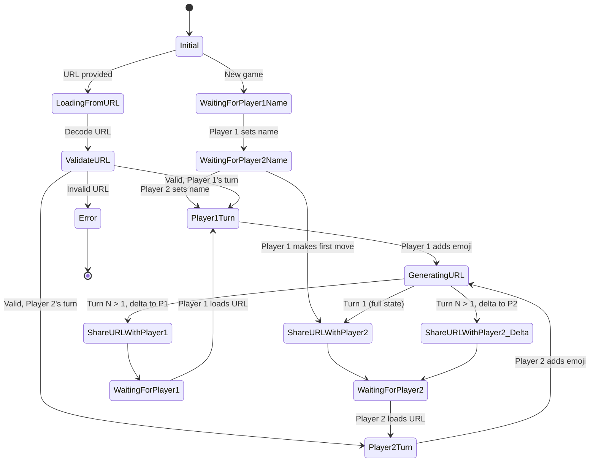
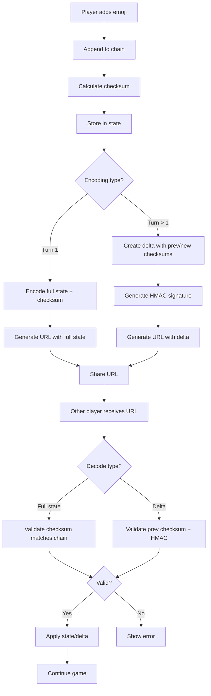

# Emoji Game State Diagrams

State machine documentation for the Emoji Chain Correspondence Game.

## Game Concept

**Emoji Chain Game**: A correspondence game where players take turns adding emojis to a growing chain.

- **Turn-based**: Players alternate adding one emoji per turn
- **Correspondence**: Uses URL encoding (full state or delta) to share game state
- **No win condition**: Game continues indefinitely (or until players decide to stop)
- **Delta encoding**: Efficient URL sharing after first move

---

## Core State Machine



---

## State Definitions

### State: Initial
**Condition**: No game state exists

**Description**: Starting point - either creating a new game or loading from URL

**Possible Paths**:
- **New Game**: User initiates new game → `WaitingForPlayer1Name`
- **Load URL**: URL hash present → `LoadingFromURL`

---

### State: WaitingForPlayer1Name
**Condition**: `gameState === null && no player1Name`

**Description**: Collecting Player 1's name before starting

**Data Needed**:
- None yet

**Display**:
- Form: "Enter your name (Player 1):"
- Input field for name
- Submit button

**Transitions**:
- User submits name → Store `player1Name`, go to `WaitingForPlayer2Name`

**Example**:
```typescript
// No game state yet
player1Name: null
player2Name: null
```

---

### State: WaitingForPlayer2Name
**Condition**: `player1Name exists && player2Name === '' && currentTurn === 0`

**Description**: Player 1 has set their name, waiting for Player 2 to join

**Data**:
```typescript
{
  gameId: "550e8400-...",
  emojiChain: "",
  currentTurn: 0,
  currentPlayer: 1,
  player1Name: "Alice",
  player2Name: "",
  checksum: ""
}
```

**Display**:
- Message: "Waiting for Player 2 to join"
- Show Player 1's name
- Option for Player 1 to make first move (skip to `ShareURLWithPlayer2`)

**Transitions**:
- Player 2 joins and sets name → `Player1Turn`
- Player 1 makes first move → `ShareURLWithPlayer2`

---

### State: Player1Turn
**Condition**: `currentPlayer === 1 && player1Name set`

**Description**: Player 1's turn to add an emoji

**Data**:
```typescript
{
  gameId: "550e8400-...",
  emojiChain: "🎮🎯",
  currentTurn: 2,
  currentPlayer: 1,
  player1Name: "Alice",
  player2Name: "Bob",
  checksum: "abc123..."
}
```

**Display**:
- Current emoji chain: "🎮🎯"
- Message: "Your turn, Alice!"
- Emoji picker or input
- Submit button to add emoji
- Turn counter: "Turn 2"

**Actions**:
- Player 1 selects emoji
- Click submit

**Transitions**:
- Submit emoji → `GeneratingURL`

---

### State: Player2Turn
**Condition**: `currentPlayer === 2 && player2Name set`

**Description**: Player 2's turn to add an emoji

**Data**:
```typescript
{
  gameId: "550e8400-...",
  emojiChain: "🎮🎯🎲",
  currentTurn: 3,
  currentPlayer: 2,
  player1Name: "Alice",
  player2Name: "Bob",
  checksum: "def456..."
}
```

**Display**:
- Current emoji chain: "🎮🎯🎲"
- Message: "Your turn, Bob!"
- Emoji picker or input
- Submit button to add emoji
- Turn counter: "Turn 3"

**Actions**:
- Player 2 selects emoji
- Click submit

**Transitions**:
- Submit emoji → `GeneratingURL`

---

### State: GeneratingURL
**Condition**: Immediately after player adds emoji

**Description**: Processing the move and generating URL to share

**Processing**:
1. Append emoji to chain: `emojiChain += newEmoji`
2. Increment turn: `currentTurn++`
3. Switch player: `currentPlayer = (currentPlayer === 1) ? 2 : 1`
4. Calculate new checksum: `checksum = await calculateChecksum(emojiChain)`
5. Determine encoding:
   - If `currentTurn === 1` → Use `encodeFullState()` (first move)
   - If `currentTurn > 1` → Use `createDelta()` + `encodeDelta()`
6. Generate URL with hash fragment

**Delta Creation** (for turns > 1):
```typescript
const delta = await createDelta(
  gameId,
  newEmoji,
  currentPlayer, // who just moved
  currentTurn,
  previousChecksum,
  newChecksum
);
const hash = encodeDelta(delta, targetPlayer); // who to share with
```

**Transitions**:
- If `currentTurn === 1` → `ShareURLWithPlayer2` (full state URL)
- If `currentTurn > 1 && nextPlayer === 1` → `ShareURLWithPlayer1` (delta URL)
- If `currentTurn > 1 && nextPlayer === 2` → `ShareURLWithPlayer2_Delta` (delta URL)

---

### State: ShareURLWithPlayer2
**Condition**: Player 1 made first move, need to share with Player 2

**Description**: Display URL for Player 2 to join/continue

**Data**:
```typescript
{
  gameId: "550e8400-...",
  emojiChain: "🎮",
  currentTurn: 1,
  currentPlayer: 2,
  player1Name: "Alice",
  player2Name: "",
  checksum: "abc123..."
}
```

**Display**:
- Message: "Share this URL with Player 2"
- URL: `https://example.com/#s=N4IgZg...` (full state)
- Copy button
- Current emoji chain: "🎮"
- Waiting message: "Waiting for Player 2..."

**URL Format**: `#s={compressed-full-state}`

**Transitions**:
- Automatically go to `WaitingForPlayer2`

---

### State: ShareURLWithPlayer2_Delta
**Condition**: After Player 1 makes move (turn > 1), need to share delta with Player 2

**Description**: Display delta URL for Player 2

**Data**:
```typescript
{
  gameId: "550e8400-...",
  emojiChain: "🎮🎯🎲",
  currentTurn: 3,
  currentPlayer: 2,
  player1Name: "Alice",
  player2Name: "Bob",
  checksum: "def456..."
}
```

**Display**:
- Message: "Share this URL with Bob"
- URL: `https://example.com/#d=N4IgZg...` (delta)
- Copy button
- Current emoji chain: "🎮🎯🎲"
- Waiting message: "Waiting for Bob..."

**URL Format**: `#d={compressed-delta}`

**Delta Contains**:
- Game ID
- Move: emoji, player, turn
- Previous checksum
- New checksum
- HMAC signature
- Target player (encoded)

**Transitions**:
- Automatically go to `WaitingForPlayer2`

---

### State: ShareURLWithPlayer1
**Condition**: After Player 2 makes move, need to share delta with Player 1

**Description**: Display delta URL for Player 1

**Display**:
- Message: "Share this URL with Alice"
- URL: `https://example.com/#d=N4IgZg...`
- Copy button
- Current emoji chain showing latest
- Waiting message: "Waiting for Alice..."

**Transitions**:
- Automatically go to `WaitingForPlayer1`

---

### State: WaitingForPlayer1
**Condition**: Player 2 made move, waiting for Player 1 to load URL

**Description**: Passive waiting state

**Display** (if viewing):
- Current emoji chain
- Message: "Waiting for Alice to make their move..."
- Turn counter
- NO emoji picker (not their turn)

**Transitions**:
- Player 1 loads URL → `LoadingFromURL` → `ValidateURL` → `Player1Turn`

---

### State: WaitingForPlayer2
**Condition**: Player 1 made move, waiting for Player 2 to load URL

**Description**: Passive waiting state

**Display** (if viewing):
- Current emoji chain
- Message: "Waiting for Bob to make their move..."
- Turn counter
- NO emoji picker (not their turn)

**Transitions**:
- Player 2 loads URL → `LoadingFromURL` → `ValidateURL` → `Player2Turn`

---

### State: LoadingFromURL
**Condition**: URL hash fragment present

**Description**: Decoding and loading game state from URL

**Processing**:
1. Check hash type:
   - `#s=` → Full state URL
   - `#d=` → Delta URL
2. Decode and parse
3. Validate with schema

**Full State Decoding**:
```typescript
const { state, targetPlayer } = decodeFullState(hash);
// state is complete EmojiGameState
// targetPlayer is 1 or 2
```

**Delta Decoding**:
```typescript
const { delta, targetPlayer } = decodeDelta(hash);
// delta contains: gameId, move (emoji, player, turn), checksums, hmac
```

**Transitions**:
- Successfully decoded → `ValidateURL`
- Failed to decode → `Error`

---

### State: ValidateURL
**Condition**: URL decoded, now validating

**Description**: Validating game state and checksums

**Validation Checks**:
1. **Schema validation**: Does state match `EmojiGameStateSchema`?
2. **Checksum validation**: Does `emojiChain` hash match `checksum`?
3. **Delta validation** (if delta):
   - Does previous checksum match current state?
   - Is HMAC signature valid?
   - Does gameId match?
4. **Turn validation**: Is `currentPlayer` and `currentTurn` consistent?

**For Delta URLs**:
```typescript
const currentState = loadGameStateFromLocalStorage();
const newEmojiChain = currentState.emojiChain + delta.move.emoji;
const calculatedChecksum = await calculateChecksum(newEmojiChain);

if (calculatedChecksum !== delta.newChecksum) {
  throw new Error('Checksum mismatch');
}

if (currentState.checksum !== delta.prevChecksum) {
  throw new Error('Previous checksum mismatch - state out of sync');
}
```

**Transitions**:
- Valid, `currentPlayer === 1` → `Player1Turn`
- Valid, `currentPlayer === 2` → `Player2Turn`
- Invalid → `Error`

---

### State: Error
**Condition**: Validation failed or invalid operation

**Description**: Error state with message

**Error Types**:
1. **Invalid URL**: Cannot decode hash fragment
2. **Checksum mismatch**: State tampering detected
3. **HMAC validation failed**: Delta signature invalid
4. **State out of sync**: Previous checksum doesn't match current state
5. **Schema validation failed**: Data doesn't match expected structure

**Display**:
- Error icon
- Error message explaining what went wrong
- Option to start new game
- Option to copy URL for debugging

**Example Messages**:
- "Invalid URL - cannot decode game state"
- "Checksum mismatch detected - game state may have been tampered with"
- "Your game state is out of sync - please load the full state URL first"

**Transitions**:
- Click "Start New Game" → `Initial`
- Click "Back" → `[*]` (exit)

---

## Data Flow: Full State URL

### Turn 1 Flow (Player 1 makes first move)

**Before Move**:
```typescript
{
  gameId: "550e8400-...",
  emojiChain: "",
  currentTurn: 0,
  currentPlayer: 1,
  player1Name: "Alice",
  player2Name: "",
  checksum: ""
}
```

**Player 1 Action**: Adds 🎮

**Processing**:
1. Append emoji: `emojiChain = "🎮"`
2. Increment turn: `currentTurn = 1`
3. Switch player: `currentPlayer = 2`
4. Calculate checksum: `checksum = await calculateChecksum("🎮")`
5. Encode full state: `hash = encodeFullState(state, targetPlayer=2)`

**After Move**:
```typescript
{
  gameId: "550e8400-...",
  emojiChain: "🎮",
  currentTurn: 1,
  currentPlayer: 2,
  player1Name: "Alice",
  player2Name: "",
  checksum: "abc123..."
}
```

**Generated URL**: `https://example.com/#s=N4IgZg...`

**URL Contains**: Entire game state compressed

---

## Data Flow: Delta URL

### Turn 2 Flow (Player 2 responds)

**Current State** (from localStorage):
```typescript
{
  gameId: "550e8400-...",
  emojiChain: "🎮",
  currentTurn: 1,
  currentPlayer: 2,
  player1Name: "Alice",
  player2Name: "Bob",
  checksum: "abc123..."
}
```

**Player 2 Action**: Adds 🎯

**Processing**:
1. Create delta:
```typescript
const delta = await createDelta(
  gameId: "550e8400-...",
  emoji: "🎯",
  player: 2,
  turn: 2,
  prevChecksum: "abc123...",
  newChecksum: await calculateChecksum("🎮🎯")
);
```

2. Encode delta: `hash = encodeDelta(delta, targetPlayer=1)`

**Delta Object**:
```typescript
{
  gameId: "550e8400-...",
  move: {
    emoji: "🎯",
    player: 2,
    turn: 2
  },
  prevChecksum: "abc123...",
  newChecksum: "def456...",
  hmac: "a1b2c3..." // HMAC signature for security
}
```

**Generated URL**: `https://example.com/#d=N4IgZg...` (much shorter!)

**Player 1 Loads Delta**:
1. Decode delta from URL
2. Load current state from localStorage
3. Validate: `currentState.checksum === delta.prevChecksum`
4. Apply delta: `emojiChain = currentState.emojiChain + delta.move.emoji`
5. Validate: `calculateChecksum(emojiChain) === delta.newChecksum`
6. Update state: `currentTurn = 2`, `currentPlayer = 1`, `emojiChain = "🎮🎯"`

---

## Checksum Flow



---

## localStorage Management

### Keys Used

```typescript
// Emoji game state
'emoji-game:game-state'

// Player names (for convenience)
'emoji-game:player-name'  // Current player's name
```

### Storage Pattern

**After Each Move**:
```typescript
// Save updated game state
localStorage.setItem(
  'emoji-game:game-state',
  JSON.stringify(gameState)
);
```

**Loading Game from Delta**:
```typescript
// 1. Load current state from localStorage
const currentStateJSON = localStorage.getItem('emoji-game:game-state');
const currentState = JSON.parse(currentStateJSON);

// 2. Decode delta from URL
const { delta, targetPlayer } = decodeDelta(window.location.hash);

// 3. Validate and apply
if (currentState.checksum === delta.prevChecksum) {
  const newChain = currentState.emojiChain + delta.move.emoji;
  const newState = {
    ...currentState,
    emojiChain: newChain,
    currentTurn: delta.move.turn,
    currentPlayer: (delta.move.player === 1) ? 2 : 1,
    checksum: delta.newChecksum
  };

  // 4. Save and display
  localStorage.setItem('emoji-game:game-state', JSON.stringify(newState));
}
```

---

## Security Considerations

### Checksum Protection
- Every state includes SHA-256 checksum of emoji chain
- Prevents tampering with emoji sequence
- Validation on every state load

### HMAC Signatures (Delta)
- Each delta signed with HMAC
- Validates delta authenticity
- Prevents forged moves

### Validation Chain
1. **Schema validation**: Structure is correct
2. **Checksum validation**: Chain matches hash
3. **HMAC validation** (delta): Signature is valid
4. **Consistency validation**: Previous checksum matches current state

---

## Comparison: Full State vs Delta

### Full State URL (`#s=`)
**Pros**:
- Complete game state
- Can start from any point
- No localStorage dependency
- Good for turn 1 or sharing full game

**Cons**:
- Larger URL size
- Grows with emoji chain length

**When to Use**:
- Turn 1 (first move)
- Sharing full game with new player
- Recovery from state loss

### Delta URL (`#d=`)
**Pros**:
- Much smaller URL
- Fixed size regardless of chain length
- More efficient for long games

**Cons**:
- Requires previous state in localStorage
- Must apply deltas in order
- Can't start from middle of game

**When to Use**:
- All turns after turn 1
- Normal game flow
- When players have synchronized state

---

## Error Handling States

### Error: Out of Sync
**Scenario**: Player loads delta but localStorage state doesn't match `prevChecksum`

**Solution**:
1. Display error: "Your game state is out of sync"
2. Provide option: "Request full state URL from opponent"
3. Opponent generates new full state URL
4. Player loads full state URL to re-sync

### Error: Invalid HMAC
**Scenario**: Delta HMAC signature doesn't match

**Solution**:
1. Display error: "Invalid move signature detected"
2. Do not apply delta
3. Request new URL from opponent

### Error: Checksum Mismatch
**Scenario**: Applied delta but new checksum doesn't match

**Solution**:
1. Display error: "Game state validation failed"
2. Revert to previous state
3. Request new URL

---

## Testing Scenarios

### ✅ Scenario 1: New Game Flow
1. Player 1 starts game → `WaitingForPlayer1Name`
2. Player 1 enters name "Alice" → `WaitingForPlayer2Name`
3. Player 1 adds 🎮 → `GeneratingURL` → `ShareURLWithPlayer2`
4. Verify: Full state URL generated (`#s=`)
5. Verify: emojiChain = "🎮", currentTurn = 1, currentPlayer = 2

### ✅ Scenario 2: Player 2 Joins
1. Player 2 loads full state URL → `LoadingFromURL` → `ValidateURL`
2. Player 2 sees emoji chain: "🎮"
3. Player 2 enters name "Bob" → `Player2Turn`
4. Player 2 adds 🎯 → `GeneratingURL` → `ShareURLWithPlayer1`
5. Verify: Delta URL generated (`#d=`)
6. Verify: emojiChain = "🎮🎯", currentTurn = 2

### ✅ Scenario 3: Delta Application
1. Player 1 loads delta URL → `LoadingFromURL`
2. Decode delta: emoji = "🎯", turn = 2
3. Load localStorage: emojiChain = "🎮"
4. Validate: prevChecksum matches
5. Apply: emojiChain = "🎮🎯"
6. Validate: newChecksum matches
7. Continue to `Player1Turn`

### ✅ Scenario 4: Checksum Validation
1. Create state with emojiChain = "🎮🎯🎲"
2. Calculate checksum
3. Tamper with chain: "🎮🎯🎪"
4. Load state → `ValidateURL`
5. Verify: Checksum mismatch detected
6. Go to `Error` state

### ✅ Scenario 5: Out of Sync
1. Player 1 at turn 5: chain = "🎮🎯🎲🎪🎨"
2. Player 2 sends delta for turn 7
3. Player 1 loads delta: prevChecksum for turn 6 doesn't match turn 5
4. Verify: Error "Out of sync"
5. Request full state URL

---

## Implementation Checklist

### Core Data Structures
- [ ] `EmojiGameState` schema with validation
- [ ] `EmojiDelta` type for delta moves
- [ ] Checksum calculation function
- [ ] HMAC generation/validation

### URL Encoding/Decoding
- [ ] `encodeFullState(state, targetPlayer)` → `#s=...`
- [ ] `decodeFullState(hash)` → `{ state, targetPlayer }`
- [ ] `createDelta(...)` → delta object
- [ ] `encodeDelta(delta, targetPlayer)` → `#d=...`
- [ ] `decodeDelta(hash)` → `{ delta, targetPlayer }`

### State Management
- [ ] Create new game
- [ ] Load game from localStorage
- [ ] Save game to localStorage
- [ ] Apply delta to current state

### Validation
- [ ] Schema validation
- [ ] Checksum validation
- [ ] HMAC validation
- [ ] Consistency checks

### UI States
- [ ] Player name entry forms
- [ ] Emoji picker/input
- [ ] Current chain display
- [ ] Turn counter
- [ ] URL display with copy button
- [ ] Error messages
- [ ] Waiting states
