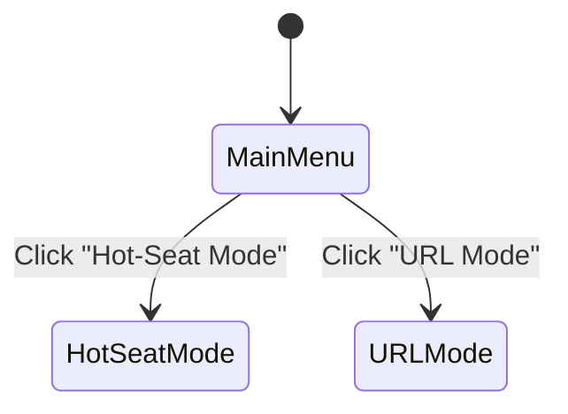
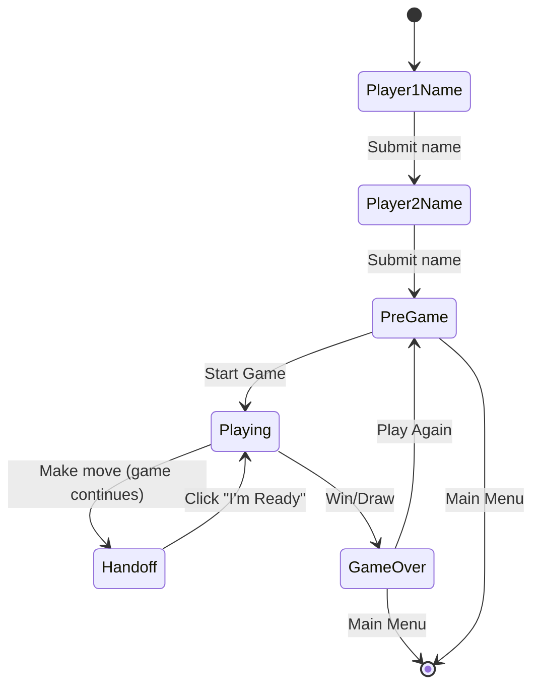
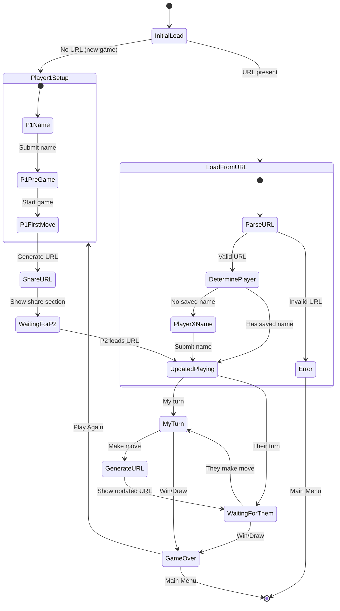

# State Diagram Template

This template provides the standard structure for documenting game states in the Correspondence Games Framework.

## Overview

Every correspondence game should have **separate state diagrams** for:
1. **Hot-Seat Mode** - Both players on same device
2. **URL Mode** - Players on different devices

**Why separate diagrams?**
- Different flows and complexity
- Easier to understand each mode independently
- Clearer documentation for developers
- Better for debugging specific mode issues

---

## Document Structure

Your `STATE_DIAGRAMS.md` file should have this structure:

```markdown
# [Game Name] State Diagrams

Brief description of the game.

## Mode Selection

[Simple diagram showing how user chooses mode]

---

## Hot-Seat Mode Flow

[Complete diagram for hot-seat mode]

### Hot-Seat Mode States

[Detailed documentation of each state]

---

## URL Mode Flow

[Complete diagram for URL mode]

### URL Mode States

[Detailed documentation of each state]

---

## Common Elements

[Shared components between modes]

---

## Testing Checklist

[Mode-specific test scenarios]
```

---

## Mode Selection Diagram

**Purpose:** Show how users enter each mode from the main menu.



**Keep this simple** - just show the entry points.

---

## Hot-Seat Mode Diagram Template

**Purpose:** Complete flow for local multiplayer on one device.

### Template



### Key Characteristics

**Hot-Seat Mode MUST have:**
- ✅ Sequential name collection (Player 1 → Player 2)
- ✅ Handoff screen between turns (prevent cheating)
- ✅ Both player names stored separately (`player1-name`, `player2-name`)
- ✅ Pre-game screen showing both names
- ✅ NO URL generation/sharing
- ✅ NO localStorage warnings

**States:**
1. **Player1Name** - Collect first player's name
2. **Player2Name** - Collect second player's name
3. **PreGame** - Show both names, ready to start
4. **Playing** - Active gameplay
5. **Handoff** - Pass device to other player
6. **GameOver** - Show results

---

## URL Mode Diagram Template

**Purpose:** Complete flow for remote play via URL sharing.

### Template



### Key Characteristics

**URL Mode MUST have:**
- ✅ Single player identity (`my-name`, not player1/player2)
- ✅ Player ID system (persistent UUID)
- ✅ URL generation after each move
- ✅ Share URL interface
- ✅ "Your turn" vs "Waiting" states
- ✅ localStorage warning on name entry
- ✅ First-time join vs returning player detection
- ✅ localStorage cleared error handling
- ✅ Full state encoding (turn 1) vs delta encoding (turn 2+)

**States:**
1. **InitialLoad** - Determine if new game or loading URL
2. **Player1Setup** - First player creates game
   - P1Name - Collect name (with warning)
   - P1PreGame - Ready to start
   - P1FirstMove - Make first move
3. **LoadFromURL** - Loading shared game
   - ParseURL - Decode and validate
   - DeterminePlayer - Figure out who I am
   - PlayerXName - First-time join (name prompt)
4. **ShareURL** - Display URL for sharing
5. **WaitingForP2** - Player 1 waiting for Player 2 to join
6. **UpdatedPlaying** - Active game state
7. **MyTurn** - I can make a move
8. **WaitingForThem** - Waiting for opponent
9. **GenerateURL** - Creating share link after move
10. **GameOver** - Show results
11. **Error** - Invalid URL or localStorage cleared

---

## State Documentation Format

For **each state**, document:

### State: [StateName]

**Condition**: The React state conditions that trigger this state
```typescript
gameMode === 'hotseat' && player1Name === null
```

**Display**:
- List exact UI elements shown
- Headers, buttons, forms, messages
- What's clickable, what's disabled

**Transitions**:
- Event → Action → Next State
- Be specific about state changes

**Example:**

### State: HSPlayer1Name

**Condition**: `gameMode === 'hotseat' && player1Name === null`

**Display**:
- Header: "🎯 Game - Hot-Seat Mode"
- Sub-header: "Player 1 (X)"
- Form with label: "Enter your name:"
- Input field: `id="player1Name"`, autoFocus, required, maxLength={20}
- Button: "Continue"
- NO localStorage warning

**Transitions**:
- Submit form →
  - Store in `localStorage['correspondence-games:player1-name']`
  - Set `player1Name` in React state
  - Go to `HSPlayer2Name`

---

## Critical Differences Between Modes

### Hot-Seat Mode

| Aspect | Implementation |
|--------|---------------|
| **Player Identity** | Two separate identities (`player1-name`, `player2-name`) |
| **Turn Management** | Handoff screen between turns |
| **State Persistence** | localStorage only |
| **Name Collection** | Sequential (P1 → P2) |
| **Warnings** | None needed |
| **Game State** | Stored locally, no sharing |

### URL Mode

| Aspect | Implementation |
|--------|---------------|
| **Player Identity** | Single identity (`my-name`), role determined by game |
| **Turn Management** | "Your turn" vs "Waiting" messages, no handoff |
| **State Persistence** | localStorage + URL encoding |
| **Name Collection** | Individual (only my name) |
| **Warnings** | ⚠️ "Keep tab open, don't clear cache" |
| **Game State** | Encoded in URLs for sharing |

---

## Common Elements

Document shared components that appear in both modes:

### Game Board/Play Area

**Display**:
- [Describe game-specific board/interface]
- Current player indicator
- Move history (if applicable)
- Status messages

### Game Over Screen

**Display** (both modes):
- Winner announcement or draw message
- Final game state
- "Play Again" button
- "Main Menu" button

**Display** (URL mode only):
- NO share URL section when game is over

### Main Menu

**Condition**: `gameMode === null`

**Display**:
- Game title
- "Play Hot-Seat Mode" button
- "Play URL Mode" button

---

## State Variables Reference

Document all React state variables:

### React State

```typescript
gameMode: 'hotseat' | 'url' | null
turnPhase: 'playing' | 'handoff'  // Hot-seat only
player1Name: string | null          // React state for UI
player2Name: string | null          // React state for UI
gameState: GameState | null         // Persisted game state
shareUrl: string                    // URL mode only
myPlayerNumber: 1 | 2 | null       // URL mode only
myPlayerId: string                  // URL mode only
```

### Game State (Persisted)

```typescript
{
  gameId: string
  // Game-specific fields
  currentTurn: number
  currentPlayer: 1 | 2
  player1: { id: string, name: string }
  player2: { id: string, name: string }
  status: 'playing' | 'player1_wins' | 'player2_wins' | 'draw'
  checksum: string
}
```

### localStorage Keys

**Hot-Seat Mode:**
- `correspondence-games:player1-name`
- `correspondence-games:player2-name`
- `correspondence-games:my-player-id`
- `[game-name]:game-state`

**URL Mode:**
- `correspondence-games:my-name`
- `correspondence-games:my-player-id`
- `[game-name]:game-state`

---

## Common Pitfalls

Document common mistakes and how to avoid them:

### ❌ Confusing React State with Game State

**Wrong:**
```typescript
// Using React state for game logic
if (player1Name === 'Alice') { /* game logic */ }
```

**Correct:**
```typescript
// Using game state for game logic
if (gameState.player1.name === 'Alice') { /* game logic */ }
```

**Rule:** React state is for UI, game state is for game logic.

### ❌ Wrong localStorage Detection (URL Mode)

**Wrong:**
```typescript
if (gameState.currentTurn > 0) {
  // Show localStorage cleared error
}
```
This triggers error for Player 2's first join!

**Correct:**
```typescript
const playerNameInGameState = myPlayerNumber === 1
  ? gameState.player1.name
  : gameState.player2.name;

if (playerNameInGameState && playerNameInGameState.trim() !== '') {
  // Player joined before but localStorage gone - ERROR
} else {
  // First time joining - show name prompt
}
```

### ❌ Using Wrong localStorage Keys

**Hot-Seat:** `player1-name` and `player2-name` (two separate people)
**URL:** `my-name` (single person, multiple games)

Don't mix them up!

---

## Testing Checklist Template

Provide mode-specific test scenarios:

### Hot-Seat Mode Tests

- [ ] Main menu → Hot-seat → Player 1 name entry
- [ ] Player 1 name → Player 2 name entry
- [ ] Player 2 name → Pre-game (both names shown)
- [ ] Pre-game → Start game → Playing state
- [ ] Make move → Handoff screen appears
- [ ] Handoff "I'm Ready" → Back to playing
- [ ] Game continues alternating turns
- [ ] Win condition → Game over screen
- [ ] Draw condition → Game over screen
- [ ] Game over → Play Again → Pre-game
- [ ] Any state → Main Menu → Clears game

### URL Mode Tests

- [ ] Main menu → URL mode → Player 1 name (with warning)
- [ ] Player 1 name → Pre-game (only P1 shown)
- [ ] Pre-game → Start game → Playing (turn 0)
- [ ] Make first move → Share URL appears
- [ ] Copy URL button works
- [ ] Paste URL in new browser → Player 2 name prompt
- [ ] Player 2 enters name → Playing state (turn 1)
- [ ] Player 2 makes move → Share URL with P1
- [ ] P1 loads delta URL → State updates correctly
- [ ] "Your turn" vs "Waiting" displays correctly
- [ ] Role switching: Ryan starts Game A as P1, Game B as P2
- [ ] localStorage cleared mid-game → Error shown
- [ ] Invalid URL → Error shown
- [ ] Game over → Share URL hidden

---

## Implementation Notes

### Mermaid Syntax Tips

**State names:**
- Use descriptive names (not S1, S2, S3)
- Prefix with mode: `HS` for hot-seat, `URL` for URL mode
- Example: `HSPlayer1Name`, `URLMyTurn`

**Composite states:**
```mermaid
state CompositeState {
    [*] --> SubState1
    SubState1 --> SubState2
}
```

**Transitions:**
```mermaid
State1 --> State2: Event description
```

### Documentation Tips

1. **Be specific:** "Button: 'Continue'" not "A button"
2. **Include examples:** Show actual code conditions
3. **Cross-reference:** Link to related docs
4. **Keep updated:** Sync with code changes
5. **Test it:** Verify diagrams match actual behavior

---

## Example Games

Reference these for complete implementations:

- **Tic-Tac-Toe:** `games/tic-tac-toe/STATE_DIAGRAMS.md`
  - Shows nested state approach (being updated to separate)
  - Complete state documentation
  - Testing checklist

- **Emoji Chain:** `packages/core/EMOJI_GAME_STATE_DIAGRAMS.md`
  - Shows URL-only game (no hot-seat)
  - Delta encoding flow
  - Security validation

---

## When to Update

Update your state diagrams when:
- ✅ Adding new states
- ✅ Changing transitions
- ✅ Modifying UI elements
- ✅ Fixing bugs related to state management
- ✅ Adding new game modes

**Keep diagrams in sync with code!**

---

## Template Checklist

When creating state diagrams for a new game:

- [ ] Created `STATE_DIAGRAMS.md` in game directory
- [ ] Included mode selection diagram
- [ ] Created separate hot-seat mode diagram
- [ ] Created separate URL mode diagram
- [ ] Documented all states with conditions, display, transitions
- [ ] Listed state variables (React + game state)
- [ ] Listed localStorage keys for each mode
- [ ] Documented common pitfalls for this game
- [ ] Created testing checklist
- [ ] Verified diagrams match actual code behavior
- [ ] Cross-referenced in game README

---

**Last Updated:** October 2025
**Version:** 1.0.0
**Framework Version:** 1.1.0
